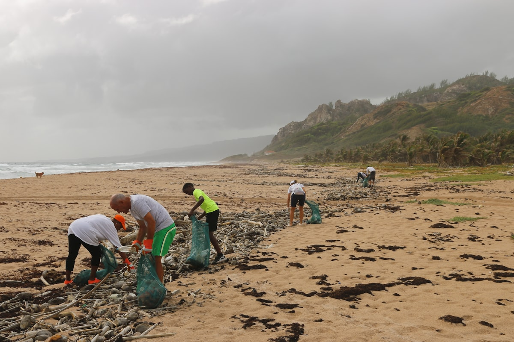

# Kindred

**A neighborhood kindness app.** Post small favors you need done and get help from people nearby — or browse requests from your neighbors and be the one who shows up.

Built with Flutter and Firebase, with AI-moderated kindness verification on a free Cloudflare Worker.


## Features

- **Post & claim requests** — ask for a Grocery Run, Lawn Care, Moving Help, Pet Care, Meal Prep, a Ride, or anything else, and let neighbors volunteer to help
- **Location-based browsing** — see requests happening near you
- **In-app chat** — coordinate directly with the person helping or being helped
- **Points, levels & recognition** — earn points for completed acts and climb from Helper to Champion to Legend
- **AI kindness verification** — acts are checked by an AI model (running securely on a Cloudflare Worker, not the app) so the community stays honest
- **Push notifications** — get notified when someone claims your request, when your help is confirmed, or when you get a message
- **In-app notifications** — unread badge and notification feed for everything happening in the app
- **Reporting** — flag bad behavior to keep the community safe



## Download the APK

The latest signed Android release is available on the [Releases page](https://github.com/jonahb344-ai/kindred/releases).

Download link: [kindred.apk](https://github.com/jonahb344-ai/kindred/releases/latest/download/kindred.apk)

> **Note:** Because the app isn't on the Play Store yet, Android may warn about installing from unknown sources. You'll need to allow "Install unknown apps" for your browser or file manager the first time.

## Tech stack

| Layer | Technology |
|---|---|
| App | Flutter (Dart) |
| Backend | Firebase (Auth, Cloud Firestore, Cloud Messaging) |
| Serverless logic | Cloudflare Worker (`worker/worker.js`) |
| AI verification | Anthropic Claude |
| Signing | Android release keystore (kept out of the repo) |

## Architecture & security

- **API keys never ship in the app** — the Anthropic key and Firebase service-account credentials live only as secrets on the Cloudflare Worker
- **Worker endpoints are authenticated** — `/verify` and `/push` reject anything without a valid Firebase ID token (verified 401 for strangers)
- **PII is locked down** — email, phone, and FCM tokens live in a `users/{uid}/private` subcollection; Firestore rules ([`firestore.rules`](firestore.rules)) only let users read their own private data
- **Strict Firestore rules** — users can only read/write their own requests, their own chats, and their own notifications
- **Push notifications are private** — FCM tokens are never exposed to other clients; the Worker reads them server-side to deliver push

## Building from source

```sh
flutter pub get
flutter build apk --release
```

The release APK will be at `build/app/outputs/flutter-apk/app-release.apk`.

To sign release builds you need the upload keystore and `android/key.properties` — both are intentionally **not** in the repository.

## Deploying the Worker

1. Create a free Worker on [Cloudflare](https://dash.cloudflare.com), paste `worker/worker.js`, deploy.
2. Add two secrets in **Settings → Variables and Secrets**:
   - `ANTHROPIC_API_KEY` — your Claude API key
   - `SERVICE_ACCOUNT` — the full JSON from Firebase → Project settings → Service accounts → *Generate new private key*
3. Set the app's `kServerBaseUrl` in `lib/main.dart` to your worker's URL.

## License

[GPL-3.0](LICENSE)
